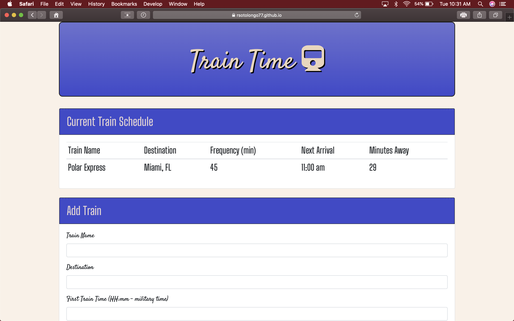

# TrainScheduler

## TrainScheduler is a web application that mimicks a train schedule board. 

## Technologies used:
1. HTML
2. Bootstrap
3. Javascript
4. jQuery
5. Firebase
6. Moment
7. CSS

### How the ap works:
 The user is allowed to input values via form, the programs logic then reflects those values to the main train schedule board. All values are logged into a third party database. 

### You can visit site at https://rsotolongo77.github.io/TrainScheduler/

